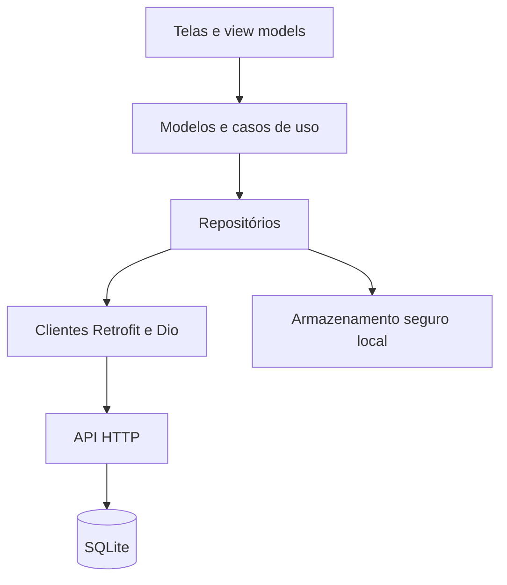
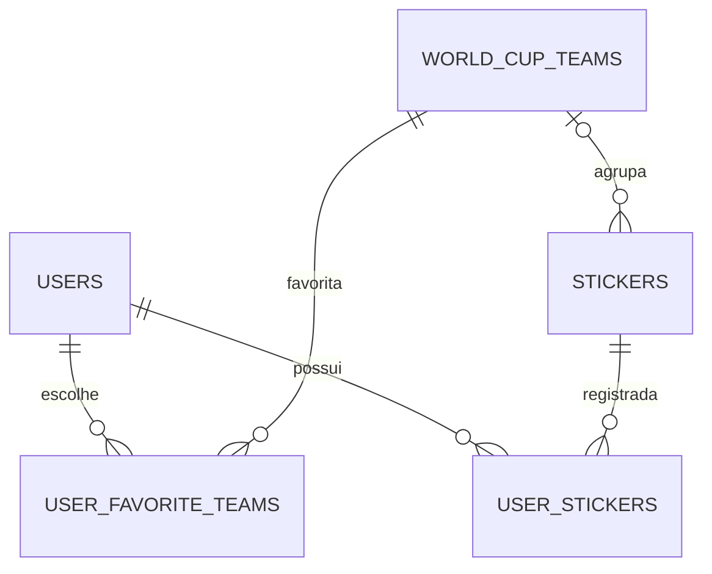
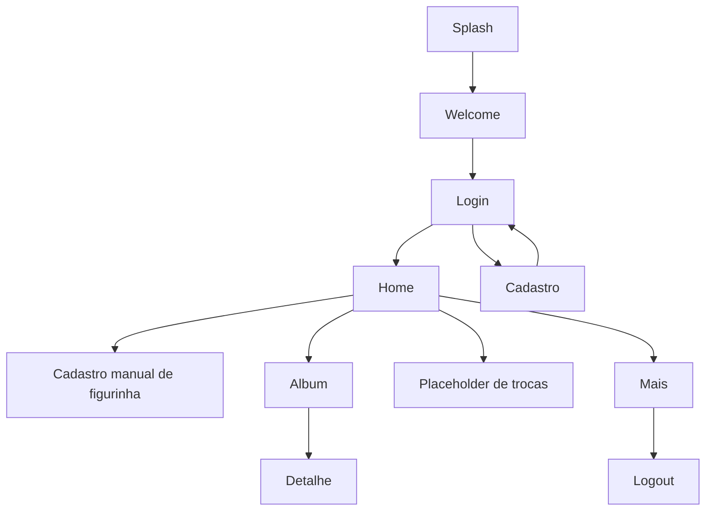

# Copa do Mundo 2026 — Álbum de Figurinhas

Aplicativo mobile em Flutter para acompanhar um álbum de figurinhas da Copa do Mundo de 2026. O repositório contém telas de autenticação e de coleção, integração com uma API HTTP e um artefato de backend com banco SQLite.

> **Atenção de segurança:** este repositório é público e `backend/.env` está versionado no Git. Trate os valores desse arquivo como expostos. Não os reutilize; rotacione `JWT_SECRET` e outras credenciais aplicáveis e remova o arquivo do histórico do repositório antes de distribuir o projeto. Nenhum valor desse arquivo é reproduzido aqui.

## Índice

- [Sobre o projeto](#sobre-o-projeto)
- [Demonstração](#demonstração)
- [Funcionalidades](#funcionalidades)
- [Arquitetura](#arquitetura)
- [Tecnologias](#tecnologias)
- [Estrutura do projeto](#estrutura-do-projeto)
- [Aplicativo Flutter](#aplicativo-flutter)
- [Backend API](#backend-api)
- [Comunicação mobile API](#comunicação-mobile-api)
- [Banco de dados](#banco-de-dados)
- [Instalação e execução](#instalação-e-execução)
- [Configuração e variáveis de ambiente](#configuração-e-variáveis-de-ambiente)
- [Testes](#testes)
- [Build de produção](#build-de-produção)
- [Docker e automação](#docker-e-automação)
- [Fluxos da aplicação](#fluxos-da-aplicação)
- [Design e Figma](#design-e-figma)
- [Screenshots](#screenshots)
- [Troubleshooting e limitações conhecidas](#troubleshooting-e-limitações-conhecidas)
- [Segurança](#segurança)
- [Contribuição](#contribuição)
- [Licença](#licença)
- [Autor e repositório](#autor-e-repositório)
- [Status e lacunas](#status-e-lacunas)

## Sobre o projeto

O aplicativo organiza a coleção de figurinhas da Copa de 2026: permite criar uma conta, acompanhar o progresso do álbum, consultar figurinhas por seleção e registrar quantidades. O contrato da API define um álbum com 980 posições: 48 seleções com 20 figurinhas cada e 20 figurinhas especiais.

O código mobile está em `mobile/`. O diretório `backend/` contém um executável Linux compilado, um banco SQLite, imagens de bandeiras e a especificação OpenAPI; o código-fonte do backend não está incluído neste checkout.

## Demonstração

- [Protótipo no Figma](https://www.figma.com/design/0uqQag571YmZbEyOHk57TM/Copa-do-mundo-2026?node-id=39-2)
- [Repositório no GitHub](https://github.com/leandro8279/flutter-experience-worldcup-2026-mobile)
- Aplicativo publicado ou demonstração online: não identificados no repositório.

## Funcionalidades

### Implementadas no aplicativo ou API

- Cadastro com nome, email, senha, aceite dos termos e seleção de ao menos uma seleção favorita.
- Login por email e senha; o backend emite JWT com validade de 24 horas.
- Restauração local da sessão e logout.
- Consulta do resumo do álbum, das figurinhas recentes e das posições agrupadas por seleção.
- Busca local no álbum e filtros por situação (`missing`, `owned` e `repeated`) e seleção.
- Registro manual de uma figurinha pelo código.
- Atualização da quantidade e remoção de uma figurinha já registrada.
- Carregamento do catálogo de seleções e das imagens de bandeiras.

### Ainda não implementadas ou incompletas no mobile

- A tela de trocas no Flutter contém apenas o texto “Trocas”. Não há endpoints de troca no contrato OpenAPI.
- Os atalhos de troca e de figurinhas repetidas na Home não executam uma navegação ou ação.
- O Figma mostra busca de trocas e uma opção de leitura por câmera, mas o código Flutter consultado oferece cadastro manual por teclado e não declara permissão ou integração com câmera.
- Os itens de perfil, notificações, ajuda e informações na tela “Mais” são apresentados como menu; o logout é a ação funcional dessa tela.

## Arquitetura

### Mobile

O app segue uma organização em camadas com pastas por funcionalidade:

- `ui/`: telas, widgets e view models.
- `domain/`: modelos de domínio e casos de uso de autenticação.
- `data/`: contratos e implementações de repositórios, APIs, modelos de transporte e mapeadores.
- `core/`: sessão, comandos assíncronos, resultados, exceções e logging.
- `config/`: injeção de dependências e configuração do ambiente.
- `routing/`: caminhos e configuração do `GoRouter`.

O estado é coordenado por `Provider`/`ChangeNotifier`; as operações assíncronas usam comandos e um tipo `Result` para separar sucesso e erro. A camada de rede utiliza `Dio` com clientes declarados por Retrofit. Os arquivos gerados `*.g.dart` são mantidos junto ao código.



### Backend

A documentação OpenAPI identifica o framework como Dart Frog. O executável incluído contém referências a Dart Frog, Drift e SQLite, mas o código-fonte, o manifesto de dependências do backend e os arquivos de migrations não estão presentes. Por isso, controllers, serviços, repositories e detalhes internos de persistência não podem ser auditados neste checkout.

## Tecnologias

| Tecnologia | Uso identificado | Versão disponível |
| --- | --- | --- |
| Flutter | Aplicativo mobile | SDK `>= 3.47.0`, conforme `pubspec.lock` |
| Dart | Linguagem do aplicativo | `>= 3.13.4 < 4.0.0` |
| Material UI | Componentes e tema Flutter | `material_ui 1.5.0` |
| Provider | Injeção de dependências e estado | `provider 6.1.5+1` |
| GoRouter | Navegação e redirecionamento por sessão | `go_router 18.0.2` |
| Dio | Cliente HTTP | `dio 5.11.1` |
| Retrofit | Declaração dos clientes REST | `retrofit 4.10.0` |
| Flutter Secure Storage | Persistência local da sessão | `flutter_secure_storage 11.2.0` |
| Google Fonts | Tipografia da interface | `google_fonts 9.0.0` |
| Flutter SVG | Renderização dos assets SVG | `flutter_svg 2.3.0` |
| JSON Serializable / Build Runner | Geração de serialização e clientes | `json_serializable 6.14.1` / `build_runner 2.16.1` |
| Dart Frog | Framework identificado pela especificação da API e pelo binário | Versão não identificada |
| SQLite | Banco de dados fornecido em `backend/data/wc_2026.db` | Arquivo com `user_version=7`; versão exata do runtime do backend não identificada |
| Drift | Biblioteca de acesso a SQLite encontrada no binário do backend | Versão e uso interno não auditáveis sem o código-fonte |

A versão do aplicativo declarada em `mobile/pubspec.yaml` é `1.0.0+1`. A versão `1.0.0` no OpenAPI é a versão da API documentada, não a versão confirmada do framework.

## Estrutura do projeto

```text
.
├── backend/
│   ├── bin/server             # executável Linux x86-64; não é o código-fonte
│   ├── data/wc_2026.db        # banco SQLite
│   ├── lib/libsqlite3.so      # biblioteca SQLite distribuída
│   └── public/
│       ├── flags/             # bandeiras das seleções
│       └── openapi.yaml       # contrato da API
├── mobile/
│   ├── android/               # projeto Android
│   ├── assets/
│   │   ├── images/
│   │   └── patterns/
│   ├── ios/                   # projeto iOS
│   ├── lib/
│   │   ├── config/
│   │   ├── core/
│   │   ├── data/
│   │   ├── domain/
│   │   ├── routing/
│   │   └── ui/
│   ├── analysis_options.yaml
│   ├── build.yaml
│   ├── pubspec.yaml
│   └── pubspec.lock
├── .replit
└── README.md
```

O diretório `mobile/lib/ui/` contém funcionalidades como `auth`, `home`, `album`, `sticker`, `trades` e `more`. O backend não contém diretórios de fonte como `routes/` ou `lib/src/`; somente o binário, recursos estáticos, banco e contrato da API estão versionados.

## Aplicativo Flutter

### Plataformas e requisitos

Há projetos nativos Android e iOS no repositório. A versão mínima do iOS configurada é 15.0. O projeto Android configura Java e Kotlin para JVM 17; o `minSdk` é herdado dos valores do Flutter e não está fixado no Gradle do app.

| Requisito | Versão ou observação |
| --- | --- |
| Flutter | `>= 3.47.0`, conforme o lockfile |
| Dart | `>= 3.13.4 < 4.0.0` |
| Java para Android | 17 |
| Android SDK | Necessário para compilar e executar no Android |
| Xcode e macOS | Necessários para compilar ou executar o target iOS |
| iOS | Deployment target 15.0 |

O ambiente deste checkout não tem os comandos `flutter` e `dart` disponíveis; portanto, os builds não foram executados durante a elaboração desta documentação.

### Telas e navegação

| Rota | Tela | Estado identificado |
| --- | --- | --- |
| `/splash` | Splash | Aguarda a restauração da sessão e anima a inicialização |
| `/welcome` | Boas-vindas | Apresenta o botão para começar |
| `/auth/login` | Login | Envia email e senha à API |
| `/auth/register` | Cadastro | Carrega seleções para escolha e valida o aceite dos termos |
| `/home` | Home | Resumo, figurinhas recentes e atalhos |
| `/album` | Álbum | Busca, filtros e posições agrupadas por seleção |
| `/sticker/:code` | Detalhe | Quantidade, salvar e remover uma posição |
| `/sticker/register` | Cadastro manual | Entrada de código por teclado |
| `/trades` | Trocas | Placeholder “Trocas” |
| `/more` | Mais | Dados locais da sessão e logout |

As rotas privadas redirecionam usuários sem sessão para o login. Depois do cadastro, o app retorna à tela de login; após o login, a sessão é persistida localmente. Quando a API rejeita com `401` ou `403` uma requisição que levou token, o app encerra a sessão.

### Estado, carregamento e erros

As operações de Home e Álbum apresentam carregamento e mensagens de erro com opção de tentar novamente. A busca sem resultados no álbum exibe uma mensagem vazia. Erros de autenticação e operações de figurinha são apresentados em mensagens da interface. O registro de uma figurinha é feito por código digitado; leitura de código de barras ou QR code não foi identificada no Flutter.

## Backend API

O contrato OpenAPI está em [`backend/public/openapi.yaml`](backend/public/openapi.yaml), usa OpenAPI 3.0.3 e declara a API na versão 1.0.0. O servidor documentado para desenvolvimento é `http://localhost:8080`.

### Endpoints documentados

| Método | Endpoint | Descrição | Autenticação |
| --- | --- | --- | --- |
| `GET` | `/` | Mensagem de boas-vindas em texto | Pública |
| `GET` | `/health` | Estado do processo e disponibilidade do SQLite | Pública |
| `POST` | `/v1/auth/login` | Login e emissão de JWT | Pública |
| `POST` | `/v1/users` | Cadastro de usuário | Pública |
| `GET` | `/v1/users/me` | Perfil associado ao token | Bearer JWT |
| `GET` | `/v1/teams` | Catálogo de seleções | Pública |
| `GET` | `/v1/album` | Posições do álbum; aceita `status` e `team` | Bearer JWT |
| `POST` | `/v1/album/stickers` | Soma unidades de uma figurinha ao álbum | Bearer JWT |
| `PUT` | `/v1/album/stickers` | Define quantidade; `0` remove a posição | Bearer JWT |
| `DELETE` | `/v1/album/stickers/{code}` | Remove uma posição do álbum | Bearer JWT |
| `GET` | `/v1/album/summary` | Contadores do álbum | Bearer JWT |
| `GET` | `/v1/album/recent` | Até 10 figurinhas adicionadas recentemente | Bearer JWT |
| `GET` | `/flags/{file}` | Arquivo PNG de bandeira | Pública |

As rotas sob `/v1` exigem JWT por padrão, exceto login, cadastro e catálogo de seleções. O token é JWT HS256, válido por 24 horas. A especificação não documenta endpoint de refresh token.

### Exemplos

Login (substitua o email e a senha por dados de teste):

```bash
API_BASE_URL="http://localhost:8080"

curl -X POST "$API_BASE_URL/v1/auth/login" \
  -H "Content-Type: application/json" \
  -d '{"email":"dev@example.invalid","password":"<SENHA_DE_TESTE>"}'
```

A resposta documentada contém um token e os dados básicos do usuário:

```json
{
  "token": "<JWT_RECEBIDO>",
  "user": {
    "name": "Usuário de teste",
    "email": "dev@example.invalid"
  }
}
```

Registro de uma figurinha (defina `TOKEN` com o JWT recebido no login):

```bash
curl -X POST "$API_BASE_URL/v1/album/stickers" \
  -H "Content-Type: application/json" \
  -H "Authorization: Bearer $TOKEN" \
  -d '{"code":"BRA-1","quantity":1}'
```

O cadastro exige nome, email, senha de 8 a 72 bytes UTF-8, ao menos uma seleção válida e `accepted_terms: true`. Um email já usado retorna `409`. Erros de validação/domínio usam JSON com `message`; a rejeição do middleware de autenticação retorna `401` sem corpo. `/health` responde `200` mesmo quando o banco está indisponível, indicando `status: degraded` e `database: down`.

## Comunicação mobile API

O app cria um cliente `Dio` com os clientes Retrofit para autenticação, catálogo de seleções e álbum. A URL base é compilada a partir de `BASE_URL`; o valor padrão atualmente no código é `http://192.168.0.109:8080`.

- Login e cadastro são marcados como rotas públicas no interceptor.
- Nas outras chamadas, o interceptor lê o token do armazenamento seguro e envia `Authorization: Bearer <token>`.
- Exceções de rede e HTTP são mapeadas para erros de aplicação.
- Respostas autenticadas `401` ou `403` encerram a sessão local.
- Não foi identificado refresh de token nem configuração explícita de timeout em `Dio`.
- Embora exista `GET /v1/users/me` no OpenAPI, o cliente Retrofit atual não declara essa chamada.

O endereço padrão é um IP de rede local e não será acessível em todos os emuladores, dispositivos ou redes. Configure um host que o dispositivo consiga alcançar; para uso fora de desenvolvimento, prefira HTTPS.

## Banco de dados

O arquivo `backend/data/wc_2026.db` é SQLite. O schema observado contém estas tabelas:

| Tabela | Responsabilidade |
| --- | --- |
| `users` | Conta, email único, hash de senha e aceite dos termos |
| `world_cup_teams` | Catálogo de seleções, cores e caminhos de bandeiras |
| `user_favorite_teams` | Relação entre usuários e seleções favoritas |
| `stickers` | Catálogo de figurinhas, opcionalmente associado a uma seleção |
| `user_stickers` | Quantidade por usuário e figurinha |

`user_favorite_teams` tem chave primária composta por `(user_id, team_id)` e `user_stickers` por `(user_id, sticker_id)`. O arquivo informa `PRAGMA user_version = 7`.



Não foram encontrados migrations, seeds ou o código que cria/conecta o banco. O arquivo `.db` está incluído no checkout; o conteúdo das linhas não é reproduzido nesta documentação.

## Instalação e execução

### Obter o projeto

Antes de usar o clone, considere o aviso de segurança: `backend/.env` está versionado em um repositório público.

```bash
git clone https://github.com/leandro8279/flutter-experience-worldcup-2026-mobile.git
cd flutter-experience-worldcup-2026-mobile
```

### Backend

O checkout não inclui o código-fonte do backend, `pubspec.yaml`, `Makefile`, migrations ou um script de execução verificável. Há um binário Linux x86-64 em `backend/bin/server`, mas o comando de inicialização e o carregamento de configuração não podem ser confirmados somente pelo artefato. O OpenAPI informa `localhost:8080` como URL de desenvolvimento, não como um serviço atualmente iniciado.

Assim, não há neste repositório um passo a passo reproduzível para instalar dependências, iniciar, testar ou recompilar o backend. Para isso, é necessário obter o projeto-fonte do backend e suas instruções de execução.

### Aplicativo Flutter

Com Flutter instalado e um dispositivo/emulador disponível:

```bash
cd mobile
flutter doctor
flutter pub get
flutter run --dart-define=BASE_URL=http://HOST_ACESSIVEL:8080
```

Substitua `HOST_ACESSIVEL` por um endereço que o dispositivo possa acessar. Se o backend já estiver disponível em outro endereço, informe a URL completa como valor de `BASE_URL`.

## Configuração e variáveis de ambiente

### Mobile

`BASE_URL` é uma constante de compilação (`String.fromEnvironment`), não uma variável carregada de arquivo `.env`.

| Variável | Uso | Obrigatória |
| --- | --- | --- |
| `BASE_URL` | URL base da API; padrão atual `http://192.168.0.109:8080` | O código tem valor padrão; normalmente precisa ser substituída para apontar ao backend usado |

Exemplo:

```bash
flutter run --dart-define=BASE_URL=https://api.exemplo.invalid
```

### Backend

Os nomes abaixo aparecem no `backend/.env`, mas a obrigatoriedade e o comportamento exato não podem ser confirmados sem o código-fonte do backend. Os valores foram deliberadamente omitidos.

| Variável | Uso provável pelo nome/contrato | Obrigatória |
| --- | --- | --- |
| `JWT_SECRET` | Segredo de assinatura/verificação dos tokens JWT | Não confirmável neste checkout; necessário para emissão segura de JWT |
| `DB_PATH` | Caminho do banco SQLite | Não confirmável neste checkout |
| `BCRYPT_COST` | Custo configurado para hash de senhas com bcrypt | Não confirmável neste checkout |

Não existe `.env.example`. Não copie `backend/.env` para outros ambientes nem publique seus valores. Crie uma configuração de desenvolvimento segura somente depois de recuperar e consultar as instruções do backend.

## Testes

Não foi encontrado diretório `mobile/test/` nem teste Dart de unidade, integração ou widget. `mobile/ios/RunnerTests/RunnerTests.swift` contém apenas o teste de exemplo padrão do Xcode. Também não há testes do backend no checkout.

Os comandos padrão para quando os testes forem adicionados são:

```bash
cd mobile
flutter test
flutter analyze
```

`flutter analyze` usa as regras declaradas em `mobile/analysis_options.yaml`. Não foi possível executar esses comandos neste ambiente porque Flutter e Dart não estão instalados.

## Build de produção

Execute os comandos a partir de `mobile/`.

### Android

```bash
flutter build apk --release
flutter build appbundle --release
```

Os artefatos são gerados em `mobile/build/app/outputs/flutter-apk/` e `mobile/build/app/outputs/bundle/release/`, respectivamente.

**Ainda não está pronto para distribuição:** a configuração `release` do Gradle usa assinatura de debug. Além disso, a permissão `INTERNET` aparece nos manifests `debug` e `profile`, mas não em `mobile/android/app/src/main/AndroidManifest.xml`; a conectividade de rede em uma build de produção precisa ser corrigida e verificada antes de publicar.

### iOS

```bash
flutter build ios --release
```

Esse build requer macOS, Xcode e configuração de assinatura Apple. O projeto define iOS 15.0 como deployment target. Não foi possível validar a geração de um pacote iOS neste ambiente Linux.

## Docker e automação

Não foram encontrados `Dockerfile`, `docker-compose.yml`, `Makefile`, pipeline de CI ou scripts raiz para automatizar build, testes ou execução.

O `.replit` atual declara apenas o módulo `swift-5.8` e não contém comando `run`; não há workflow de execução Replit configurado para o Flutter ou para o backend neste checkout.

## Fluxos da aplicação

### Navegação



O fluxo protegido depende da sessão restaurada: rotas privadas sem sessão redirecionam para login; uma sessão ativa redireciona telas públicas para Home. A tela de boas-vindas contém um botão funcional para login; o atalho secundário “Já tenho conta · Entrar” não tem ação conectada no código atual.

### Autenticação

1. O usuário envia email e senha a `POST /v1/auth/login`.
2. A API retorna JWT HS256 e os dados básicos do usuário.
3. O app guarda token e dados da sessão via `flutter_secure_storage`.
4. O interceptor acrescenta o token às chamadas protegidas.
5. Uma resposta autenticada `401` ou `403` encerra a sessão local.
6. Logout remove token e dados locais.

Não há refresh token documentado ou implementado no cliente observado.

## Design e Figma

O [arquivo Figma](https://www.figma.com/design/0uqQag571YmZbEyOHk57TM/Copa-do-mundo-2026?node-id=39-2) mostra telas de Home, Álbum, detalhe de figurinha, cadastro de figurinha e busca de trocas. A implementação Flutter contém telas para os fluxos de Home, Álbum, detalhe, cadastro manual e abas principais, mas a tela de trocas ainda é um placeholder; o protótipo visual não significa que todos os fluxos estejam funcionais.

O tema implementado usa:

- Cores principais: tinta `#0E1117`, creme `#F4F1EB`, vermelho `#C82426`, amarelo `#FFD133` e verde `#396E39`.
- `Archivo Black` para títulos, números e botões; `DM Sans` para texto corrido e rótulos, via `google_fonts`.
- Cartões arredondados, botões em formato de pílula, indicadores de progresso e cores de seleção nas figurinhas.
- Assets locais em `mobile/assets/images/` e `mobile/assets/patterns/`, além das bandeiras servidas pelo backend.

Não foi possível confirmar no código estados interativos de todas as telas do Figma, nem correspondência exata de cada componente com o protótipo. A navegação de trocas e o scanner visual do Figma, em particular, não estão implementados no app observado.

## Screenshots

Não foram encontradas capturas de tela do aplicativo versionadas no projeto. O link do Figma acima serve como referência visual; não há aplicativo publicado ou demonstração executável identificada.

## Troubleshooting e limitações conhecidas

| Sintoma ou limitação | O que foi verificado |
| --- | --- |
| App não conecta à API | `BASE_URL` usa por padrão um IP de rede local. Configure uma URL alcançável pelo dispositivo e confirme que a API está disponível. |
| API não inicia a partir do checkout | O código-fonte, manifesto do backend e comando de execução não estão presentes; o binário não foi executado nem validado. |
| Build Android não acessa a rede | A permissão `INTERNET` não está no manifest principal. Confirme/corrija a configuração antes de distribuir. |
| Build Android não serve para publicação | O build `release` usa configuração de assinatura debug. |
| Replit não inicia o app | `.replit` não configura `flutter run` nem um comando de servidor e não há workflow ativo. |
| Trocas não funcionam | A tela e os atalhos correspondentes ainda não têm comportamento funcional, e não há endpoints de troca no OpenAPI. |
| Testes não são encontrados | Não há testes Flutter no repositório; somente o arquivo iOS de exemplo do Xcode. |

O endereço padrão do app usa HTTP. O `Info.plist` não declara exceções de App Transport Security; use um endpoint HTTPS para ambientes que imponham transporte seguro ou valide a configuração de desenvolvimento separadamente.

## Segurança

- **Credenciais do backend:** `backend/.env` está versionado e o repositório é público. Considere seus valores expostos. Remova o arquivo do histórico, adicione configurações locais ao `.gitignore` e rotacione `JWT_SECRET` e outras credenciais aplicáveis. Essa limpeza do Git não foi executada como parte da documentação.
- **Mobile:** o token e os dados da sessão são armazenados com `flutter_secure_storage`; o token é enviado no header `Authorization`.
- **Senhas:** o contrato da API informa comparação com hash bcrypt. O app envia a senha no corpo do login/cadastro; use HTTPS em ambientes fora de desenvolvimento.
- **Distribuição Android:** a assinatura debug e a permissão de rede ausente no manifest principal precisam ser corrigidas antes de qualquer release público.
- Não há política de privacidade, termos completos ou instruções de gerenciamento de segredos identificados neste checkout.

## Contribuição

Não há política de contribuição, padrão de commits ou fluxo de pull request definido no repositório. Antes de abrir uma alteração:

1. Crie uma branch para o trabalho:

   ```bash
   git checkout -b feature/minha-alteracao
   ```

2. Descreva o comportamento alterado e rode `flutter analyze`.
3. Quando houver testes no projeto, execute-os com `flutter test`.
4. Não inclua `.env`, tokens, chaves de assinatura ou dados pessoais nos commits.

## Licença

Este projeto não possui uma licença definida no repositório. Os nomes, marcas e assets relacionados à Copa, FIFA ou Panini não indicam por si só uma licença de uso para redistribuição.

## Autor e repositório

O proprietário público do repositório informado é [@leandro8279](https://github.com/leandro8279). A autoria individual de cada recurso não pode ser determinada apenas pelo checkout.

## Status e lacunas

O projeto está em desenvolvimento: autenticação e operações básicas do álbum estão conectadas à API, enquanto trocas e parte dos atalhos da Home ainda são placeholders.

Informações que não puderam ser confirmadas neste checkout:

- Código-fonte, versão exata das dependências, migrations, seeds, comandos de inicialização e testes do backend.
- Se as três variáveis de ambiente do backend são obrigatórias e quais são seus valores apropriados.
- Versão exata do Flutter usada pelo autor; o repositório registra o mínimo do SDK via lockfile.
- Testes Flutter, pipeline de CI, containerização, screenshots, licença e URL de produção.
- Compatibilidade completa do protótipo Figma com todas as interações e estados da implementação.